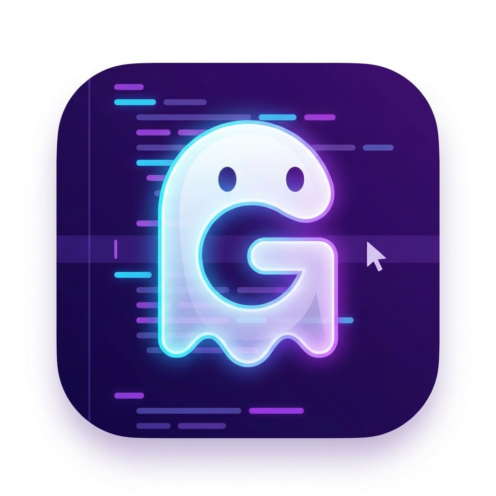

# Ghost Design

**Pixel Perfect, Instantly.**

Stop Alt-Tabbing between Figma and VS Code. "Ghost Design" allows you to overlay a transparent design image directly onto your code editor background. This enables you to code "pixel-perfect" interfaces by visually matching your code to the design mockup.

## Features

- **Ghost Layer**: Select any design image (PNG, JPG, WebP) to float behind your text.
- **Scroll Sync**: The design attaches to your document, scrolling perfectly with your code.
- **Opacity Control**: Adjust the visibility (0.1 - 1.0) to keep your code readable while checking alignment.
- **Hot-Swapping**: Quickly switch designs or adjust opacity without restarting.

## Usage

1.  **Load Design**: 
    - Open the Command Palette (`Ctrl+Shift+P` / `Cmd+Shift+P`).
    - Run `Ghost Design: Load`.
    - Select your design image from your computer.
    
2.  **Adjust Opacity**: 
    - Run `Ghost Design: Opacity`.
    - Enter a value between `0.1` (faint) and `1.0` (solid). Default is `0.3`.

3.  **Clear**: 
    - Run `Ghost Design: Clear` to remove the overlay.

## Troubleshooting

### Image not showing?
- Ensure the file path doesn't contain special characters that might break the URI.
- Verify the image file is valid (PNG, JPG, JPEG, WEBP).
- Try setting opacity to `1.0` to ensure it's not too faint.

### Image doesn't scroll with text?
- The extension uses `background-attachment: local` to attach the image to the text content. If you have custom CSS extensions installed, they might interfere.

### Text is unreadable?
- Lower the opacity using the `Ghost Design: Opacity` command (try `0.1` or `0.2`).
- Ensure your editor theme contrasts well with the design image.

## License

[MIT](LICENSE)
